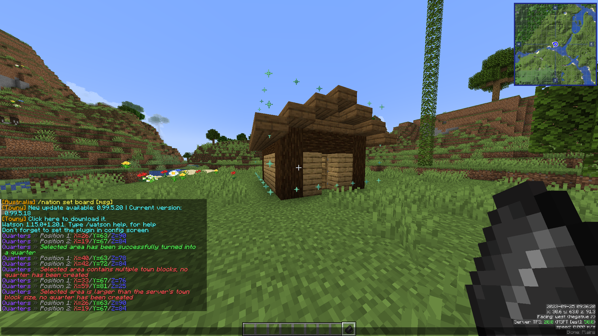

❤️ A special thank you to my sponsors who are helping to make development possible.

- CorruptedGreed
- Lumpooni (Lumpeeh)
- sab2003
- OISARJR (YOUHAVENORIGHTS3)
- Colt_44_magnum
- ccryptae (Cryptae)
- SeexyyRed
- dres2 (Dres2)
- Aylywyn
- Maxxiimus
- pymsrps3213
- exploding_turtle
- Proser
- TiowoiT
- Lgos
- PoppyK (PoppyKai)
- Ghostyuuu (Ghostyuu)
- NixWolvercraft
- nidomas
- 9DF
- w1shful (wishful_)

...and 2 other private sponsors

⭐ If you would like to support my development efforts and get special consideration for features, you can sponsor me on [GitHub](https://github.com/sponsors/Fruitloopins) or [Patreon](https://patreon.com/Fruitloopins).

---

# Quarters
Because residents deserve the bare minimum.

Quarters allows for much finer control over properties within a Towny town.

Players can use a wand or a series of user-friendly commands to subdivide their town into 3D areas. The advantage this provides over stock Towny is not being limited by the perms applying to an entire town block, you can give players permissions to much more specific areas and stop wasting your land.

The wand item is flint by default, this can be used to select two corners that form a rectangular cuboid area that can be turned into a "quarter" (as in "living quarters") by a player using `/q create`. The flint also makes a handy tool to covertly scratch your tenant's floors to ensure you keep the security deposit.

While a player is holding the wand item, both their currently selected area and quarters that currently exist within the town they are standing in will be displayed with an outline of particles.

